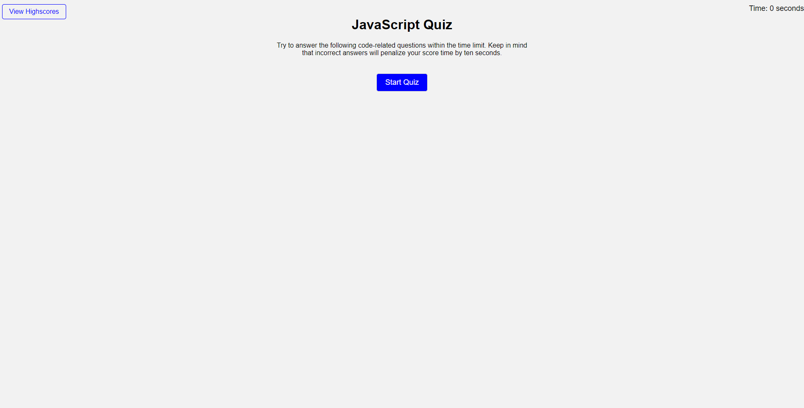
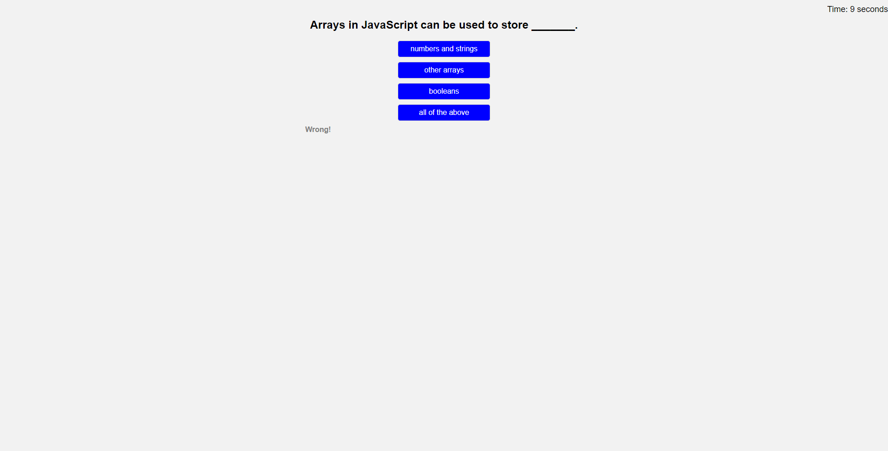
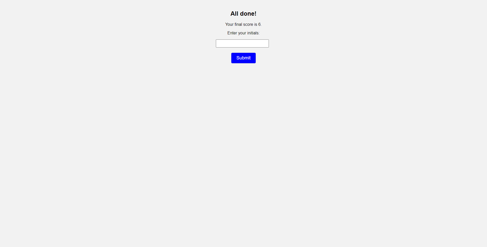

# C4-JSQuiz
## Main Task

this Challenge invites you to build a timed coding quiz with multiple-choice questions.

## Requirements:

## User Story

```
AS A coding boot camp student
I WANT to take a timed quiz on JavaScript fundamentals that stores high scores
SO THAT I can gauge my progress compared to my peers
```
## Acceptance Criteria

```
GIVEN I am taking a code quiz
WHEN I click the start button
THEN a timer starts and I am presented with a question
WHEN I answer a question
THEN I am presented with another question
WHEN I answer a question incorrectly
THEN time is subtracted from the clock
WHEN all questions are answered or the timer reaches 0
THEN the game is over
WHEN the game is over
THEN I can save my initials and my score
```
> **(Main Task, User Story and Acceptance Criteria / Challenge 4; CARL-VIRT-FSF-PT-04-2023, README.md 2023)** 

## Final Work Review

**"Always leave the code a little cleaner than when you found it."**  This action was applied to HTML, CSS and JAVASCRIPT. To create an online Quiz from scratch, I used Jon Ducket's JAVASCRIPT & JQuery book, Google, W3Schools, CSSPortal, Snyk and all ZOOM recordings (of previous classes). Looks much cleaner, organised and easier to find what you are looking for. Comments were added in JAVASCRIPT to show what was done and for what purpose.


> **(CARL-VIRT-FSF-PT-04-2023, Challenge 4 / README.md 2023)**
> **(JAVASCRIPT & JQUERRY, Jon Duckett, Wiley; First edition (June 30 2014) pages 14-292. )**

The following images show the quiz's appearance and functionality. (See below)

### How the Quiz looks:



### How the Quiz looks: During with a "Correct!" answer:


### How the Quiz looks: During with a "Wrong!" answer: 



### How the Quiz looks: At the End, showing the "All done!" and asking for initials:



### How the Quiz looks: At the End, showing the "Highscores":


